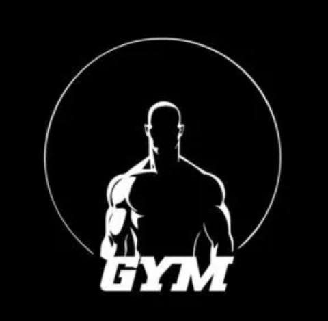

# DEMO GYM 🏋️‍♂️

A modern, premium fitness management and showcase platform designed for state-of-the-art gyms.



## 🌟 Features

- **Modern UI/UX**: Built with a sleek, gaming-inspired aesthetic using Tailwind CSS and Framer Motion.
- **Interactive Components**: Dynamic animations and transitions for a premium feel.
- **Gym Management**: Track team members, training programs, and social interactions.
- **Responsive Design**: Fully optimized for mobile, tablet, and desktop viewing.
- **Social Integration**: Seamless links to community and gym social profiles.

## 🚀 Tech Stack

- **Framework**: [React 19](https://react.dev/)
- **Build Tool**: [Vite](https://vitejs.dev/)
- **Language**: [TypeScript](https://www.typescriptlang.org/)
- **Styling**: [Tailwind CSS](https://tailwindcss.com/)
- **Animations**: [Framer Motion](https://www.framer.com/motion/)
- **Icons**: [Lucide React](https://lucide.dev/)

## 🛠️ Getting Started

### Prerequisites

- [Node.js](https://nodejs.org/) (Latest LTS recommended)
- [npm](https://www.npmjs.com/)

### Installation

1. Clone the repository:
   ```bash
   git clone https://github.com/finding-sahil/DemoGym.git
   ```

2. Navigate to the project directory:
   ```bash
   cd "DEMO GYM"
   ```

3. Install dependencies:
   ```bash
   npm install
   ```

4. Start the development server:
   ```bash
   npm run dev
   ```

## 📦 Building for Production

To create an optimized production build:

```bash
npm run build
```

The output will be in the `dist/` directory.

## 📄 License

This project is private and intended for demonstration purposes.

---

Created with ❤️ by Antigravity
